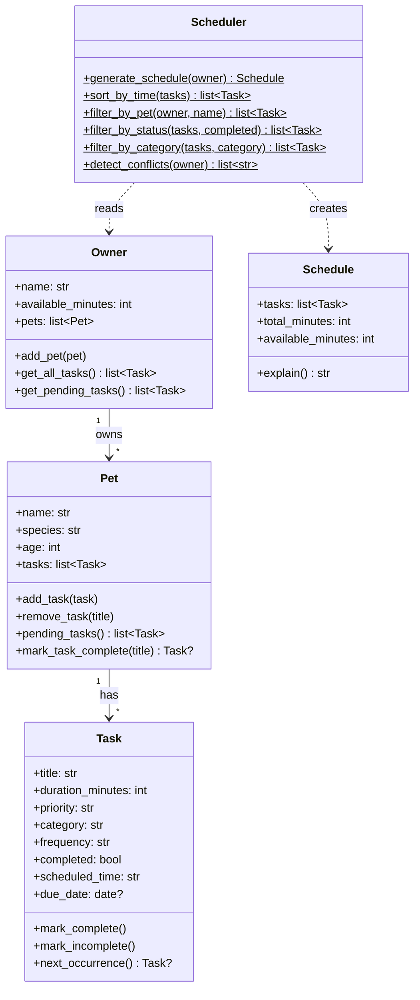

# PawPal+ (Module 2 Project)

**PawPal+** is a Streamlit-powered pet care planning assistant. It helps a busy pet owner organise daily care tasks across multiple pets using priority-based scheduling, conflict detection, and recurring task automation.

## Features

- **Owner & Pet Management** — Create an owner profile with a daily time budget; add multiple pets with species and age
- **Task Management** — Add tasks with title, duration, priority, category, scheduled time, and recurrence frequency
- **Priority-Based Scheduling** — Greedy algorithm sorts tasks high > medium > low, shorter tasks first within tiers, fitting as many as possible into the time budget
- **Time-Based Sorting** — Tasks displayed chronologically by HH:MM scheduled time
- **Filtering** — Filter the task list by pet, completion status, or category
- **Conflict Detection** — Warns when two or more pending tasks share the same scheduled time (same pet or cross-pet)
- **Recurring Tasks** — Daily and weekly tasks auto-generate their next occurrence when marked complete
- **Schedule Explanation** — Shows time used vs available, lists skipped tasks with reasons

## System Architecture (UML)



## Testing PawPal+

Run the test suite:

```bash
python -m pytest tests/ -v
```

The suite covers **35 tests** across 7 test classes:

| Class | What it tests |
|---|---|
| `TestTask` | Completion toggling, recurring task generation (daily/weekly/as_needed) |
| `TestPet` | Add/remove tasks, pending filter, mark_task_complete with auto-recurrence |
| `TestScheduler` | Priority ordering, time budget, completed skipping, empty schedule, explain output |
| `TestSortByTime` | Chronological sorting, untimed tasks placed last |
| `TestFiltering` | Filter by pet, status, category; missing pet returns empty |
| `TestConflictDetection` | Same-pet conflict, cross-pet conflict, no false positives, completed tasks ignored |
| `TestEdgeCases` | Zero budget, all completed, oversized task, no pets, no tasks, nonexistent title |

**Confidence Level: 4/5** — Core scheduling, filtering, and conflict logic are well-tested. The main gaps are UI integration tests (Streamlit) and duration-based overlap detection, which was intentionally deferred.

## Getting Started

### Setup

```bash
python -m venv .venv
source .venv/bin/activate  # Windows: .venv\Scripts\activate
pip install -r requirements.txt
```

### Run the app

```bash
streamlit run app.py
```

### Run the CLI demo

```bash
python main.py
```

### Run tests

```bash
python -m pytest tests/ -v
```
